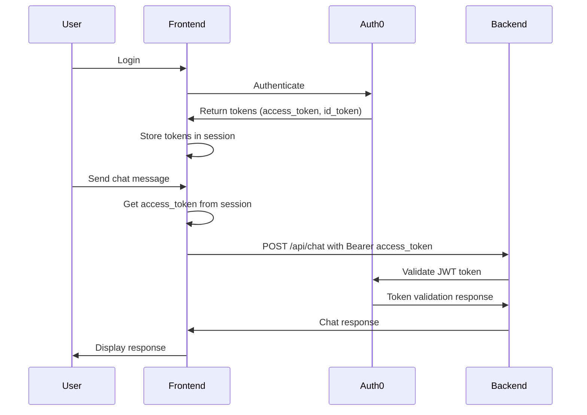

# Design Document

## Overview

The authentication issue stems from a mismatch between how the frontend sends authentication tokens and how the backend expects to receive them. The frontend is currently sending a session cookie as a Bearer token, while the backend expects a proper Auth0 JWT access token. This design addresses the authentication flow to ensure proper token handling between frontend and backend.

## Architecture

### Current Authentication Flow Issues

1. **Frontend**: Uses Auth0 NextJS SDK but sends session cookies instead of access tokens
2. **Backend**: Expects Auth0 JWT tokens with proper validation
3. **Token Mismatch**: Session cookies are not valid JWT tokens for the backend

### Proposed Authentication Flow



## Components and Interfaces

### 1. Frontend Token Management

**File**: `frontend/src/lib/auth-utils.ts`
- Extract Auth0 access token from user session
- Handle token refresh when needed
- Provide utility functions for authenticated API requests

**File**: `frontend/src/hooks/useAuth.ts`
- Custom hook for authentication state management
- Access token retrieval and refresh logic
- Error handling for authentication failures

### 2. API Request Interceptor

**File**: `frontend/src/lib/api-client.ts`
- Centralized API client with automatic token injection
- Request/response interceptors for authentication
- Error handling for 401/403 responses

### 3. Chat API Route Enhancement

**File**: `frontend/src/app/api/chat/route.ts`
- Update to use proper Auth0 access token instead of session cookie
- Implement token extraction from Auth0 session
- Add proper error handling for authentication failures

### 4. Backend Authentication Validation

**File**: `backend/app/core/auth.py` (existing, needs verification)
- Ensure proper Auth0 JWT validation
- Handle token expiration and refresh scenarios
- Provide clear error messages for authentication failures

## Data Models

### Auth Token Structure
```typescript
interface AuthTokens {
  access_token: string;
  id_token: string;
  refresh_token?: string;
  expires_at: number;
  token_type: 'Bearer';
}

interface UserSession {
  user: {
    sub: string;
    email: string;
    name: string;
    picture?: string;
  };
  tokens: AuthTokens;
}
```

### API Request Headers
```typescript
interface AuthenticatedRequestHeaders {
  'Authorization': `Bearer ${string}`;
  'Content-Type': 'application/json';
}
```

## Error Handling

### Authentication Error Types

1. **Token Missing**: No access token available in session
2. **Token Expired**: Access token has expired and refresh failed
3. **Token Invalid**: JWT validation failed on backend
4. **Auth0 Service Error**: Auth0 service unavailable

### Error Response Format
```typescript
interface AuthError {
  error: 'AUTHENTICATION_ERROR' | 'TOKEN_EXPIRED' | 'TOKEN_INVALID';
  message: string;
  details?: {
    reason: string;
    action: 'login' | 'refresh' | 'retry';
  };
}
```

### Error Handling Strategy

1. **Frontend Error Handling**:
   - Detect 401 responses and attempt token refresh
   - Redirect to login if refresh fails
   - Show user-friendly error messages
   - Implement retry logic for transient failures

2. **Backend Error Handling**:
   - Return structured error responses
   - Log authentication failures for monitoring
   - Provide clear error messages for debugging

## Testing Strategy

### Unit Tests

1. **Frontend Token Utilities**:
   - Test token extraction from Auth0 session
   - Test token refresh logic
   - Test error handling scenarios

2. **API Client**:
   - Test automatic token injection
   - Test request/response interceptors
   - Test authentication error handling

3. **Backend Authentication**:
   - Test JWT token validation
   - Test token expiration handling
   - Test error response formatting

### Integration Tests

1. **End-to-End Authentication Flow**:
   - Test complete login to chat message flow
   - Test token refresh scenarios
   - Test authentication error recovery

2. **API Endpoint Tests**:
   - Test chat API with valid tokens
   - Test chat API with invalid/expired tokens
   - Test error response handling

### Manual Testing Scenarios

1. **Happy Path**: Login → Send chat message → Receive response
2. **Token Expiration**: Login → Wait for token expiration → Send message → Auto-refresh → Success
3. **Authentication Failure**: Invalid token → Clear error message → Redirect to login
4. **Network Issues**: Auth0 service down → Graceful error handling

## Implementation Phases

### Phase 1: Frontend Token Management
- Create auth utilities for token extraction
- Implement useAuth hook
- Update chat API route to use access tokens

### Phase 2: API Client Enhancement
- Create centralized API client
- Implement request/response interceptors
- Add authentication error handling

### Phase 3: Error Handling & UX
- Implement comprehensive error handling
- Add user-friendly error messages
- Implement automatic retry logic

### Phase 4: Testing & Validation
- Write comprehensive test suite
- Perform end-to-end testing
- Validate error scenarios

## Security Considerations

1. **Token Storage**: Use secure session storage for tokens
2. **Token Transmission**: Always use HTTPS for token transmission
3. **Token Validation**: Strict JWT validation on backend
4. **Error Information**: Avoid exposing sensitive information in error messages
5. **Session Management**: Proper session cleanup on logout
6. **CSRF Protection**: Implement CSRF protection for state-changing operations