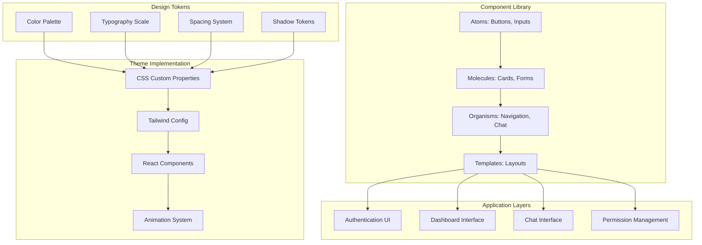
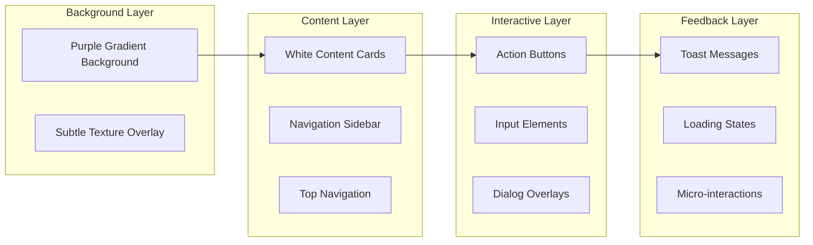

# Design Document

## Overview

The Slack-inspired theme transforms the CipherMate frontend into a modern, professional interface that leverages Slack's proven design language while maintaining the unique identity of the AI agent platform. The design emphasizes visual hierarchy, intuitive navigation, and a cohesive color system built around a distinctive purple gradient background.

The theme implementation focuses on creating a design system that is both scalable and maintainable, using CSS custom properties, Tailwind CSS utilities, and React component patterns that ensure consistency across all user interfaces.

## Architecture

### Design System Architecture



### Visual Hierarchy System



## Components and Interfaces

### 1. Color System

#### Primary Color Palette
```css
:root {
  /* Primary Purple Gradient */
  --color-primary-50: #faf5ff;
  --color-primary-100: #f3e8ff;
  --color-primary-200: #e9d5ff;
  --color-primary-300: #d8b4fe;
  --color-primary-400: #c084fc;
  --color-primary-500: #a855f7;
  --color-primary-600: #9333ea;
  --color-primary-700: #7c3aed;
  --color-primary-800: #6b21a8;
  --color-primary-900: #581c87;
  
  /* Background Gradients */
  --gradient-primary: linear-gradient(135deg, #667eea 0%, #764ba2 100%);
  --gradient-secondary: linear-gradient(135deg, #f093fb 0%, #f5576c 100%);
  --gradient-accent: linear-gradient(135deg, #4facfe 0%, #00f2fe 100%);
  
  /* Semantic Colors */
  --color-success: #10b981;
  --color-warning: #f59e0b;
  --color-error: #ef4444;
  --color-info: #3b82f6;
  
  /* Neutral Colors */
  --color-gray-50: #f9fafb;
  --color-gray-100: #f3f4f6;
  --color-gray-200: #e5e7eb;
  --color-gray-300: #d1d5db;
  --color-gray-400: #9ca3af;
  --color-gray-500: #6b7280;
  --color-gray-600: #4b5563;
  --color-gray-700: #374151;
  --color-gray-800: #1f2937;
  --color-gray-900: #111827;
}
```

#### Background System
```css
/* Main application background */
.app-background {
  background: var(--gradient-primary);
  min-height: 100vh;
  position: relative;
}

.app-background::before {
  content: '';
  position: absolute;
  top: 0;
  left: 0;
  right: 0;
  bottom: 0;
  background-image: 
    radial-gradient(circle at 25% 25%, rgba(255,255,255,0.1) 0%, transparent 50%),
    radial-gradient(circle at 75% 75%, rgba(255,255,255,0.05) 0%, transparent 50%);
  pointer-events: none;
}
```

### 2. Typography System

#### Font Configuration
```css
:root {
  /* Font Families */
  --font-primary: 'Inter', -apple-system, BlinkMacSystemFont, 'Segoe UI', sans-serif;
  --font-mono: 'JetBrains Mono', 'Fira Code', monospace;
  
  /* Font Sizes */
  --text-xs: 0.75rem;    /* 12px */
  --text-sm: 0.875rem;   /* 14px */
  --text-base: 1rem;     /* 16px */
  --text-lg: 1.125rem;   /* 18px */
  --text-xl: 1.25rem;    /* 20px */
  --text-2xl: 1.5rem;    /* 24px */
  --text-3xl: 1.875rem;  /* 30px */
  --text-4xl: 2.25rem;   /* 36px */
  
  /* Line Heights */
  --leading-tight: 1.25;
  --leading-normal: 1.5;
  --leading-relaxed: 1.75;
  
  /* Font Weights */
  --font-light: 300;
  --font-normal: 400;
  --font-medium: 500;
  --font-semibold: 600;
  --font-bold: 700;
}
```

#### Typography Components
```tsx
// Typography component system
export const Typography = {
  H1: ({ children, className = "" }) => (
    <h1 className={`text-4xl font-bold text-gray-900 leading-tight ${className}`}>
      {children}
    </h1>
  ),
  
  H2: ({ children, className = "" }) => (
    <h2 className={`text-3xl font-semibold text-gray-800 leading-tight ${className}`}>
      {children}
    </h2>
  ),
  
  H3: ({ children, className = "" }) => (
    <h3 className={`text-2xl font-medium text-gray-700 leading-normal ${className}`}>
      {children}
    </h3>
  ),
  
  Body: ({ children, className = "" }) => (
    <p className={`text-base text-gray-600 leading-relaxed ${className}`}>
      {children}
    </p>
  ),
  
  Caption: ({ children, className = "" }) => (
    <span className={`text-sm text-gray-500 ${className}`}>
      {children}
    </span>
  )
};
```

### 3. Component Library

#### Card Component System
```tsx
interface CardProps {
  children: React.ReactNode;
  variant?: 'default' | 'elevated' | 'outlined';
  padding?: 'sm' | 'md' | 'lg';
  className?: string;
}

export const Card: React.FC<CardProps> = ({ 
  children, 
  variant = 'default', 
  padding = 'md',
  className = '' 
}) => {
  const baseClasses = 'bg-white rounded-xl transition-all duration-200';
  
  const variantClasses = {
    default: 'shadow-sm border border-gray-100',
    elevated: 'shadow-lg shadow-purple-500/10 border-0',
    outlined: 'shadow-none border-2 border-gray-200'
  };
  
  const paddingClasses = {
    sm: 'p-4',
    md: 'p-6',
    lg: 'p-8'
  };
  
  return (
    <div className={`${baseClasses} ${variantClasses[variant]} ${paddingClasses[padding]} ${className}`}>
      {children}
    </div>
  );
};
```

#### Button Component System
```tsx
interface ButtonProps {
  children: React.ReactNode;
  variant?: 'primary' | 'secondary' | 'outline' | 'ghost';
  size?: 'sm' | 'md' | 'lg';
  disabled?: boolean;
  loading?: boolean;
  onClick?: () => void;
  className?: string;
}

export const Button: React.FC<ButtonProps> = ({
  children,
  variant = 'primary',
  size = 'md',
  disabled = false,
  loading = false,
  onClick,
  className = ''
}) => {
  const baseClasses = 'inline-flex items-center justify-center font-medium rounded-lg transition-all duration-200 focus:outline-none focus:ring-2 focus:ring-offset-2';
  
  const variantClasses = {
    primary: 'bg-gradient-to-r from-purple-600 to-purple-700 text-white hover:from-purple-700 hover:to-purple-800 focus:ring-purple-500 shadow-lg shadow-purple-500/25',
    secondary: 'bg-gray-100 text-gray-900 hover:bg-gray-200 focus:ring-gray-500',
    outline: 'border-2 border-purple-600 text-purple-600 hover:bg-purple-50 focus:ring-purple-500',
    ghost: 'text-purple-600 hover:bg-purple-50 focus:ring-purple-500'
  };
  
  const sizeClasses = {
    sm: 'px-3 py-1.5 text-sm',
    md: 'px-4 py-2 text-base',
    lg: 'px-6 py-3 text-lg'
  };
  
  return (
    <button
      className={`${baseClasses} ${variantClasses[variant]} ${sizeClasses[size]} ${disabled ? 'opacity-50 cursor-not-allowed' : ''} ${className}`}
      disabled={disabled || loading}
      onClick={onClick}
    >
      {loading && (
        <svg className="animate-spin -ml-1 mr-2 h-4 w-4" fill="none" viewBox="0 0 24 24">
          <circle className="opacity-25" cx="12" cy="12" r="10" stroke="currentColor" strokeWidth="4" />
          <path className="opacity-75" fill="currentColor" d="M4 12a8 8 0 018-8V0C5.373 0 0 5.373 0 12h4zm2 5.291A7.962 7.962 0 014 12H0c0 3.042 1.135 5.824 3 7.938l3-2.647z" />
        </svg>
      )}
      {children}
    </button>
  );
};
```

### 4. Layout Components

#### Main Layout Structure
```tsx
interface LayoutProps {
  children: React.ReactNode;
  sidebar?: React.ReactNode;
  header?: React.ReactNode;
}

export const Layout: React.FC<LayoutProps> = ({ children, sidebar, header }) => {
  return (
    <div className="app-background">
      <div className="min-h-screen flex">
        {/* Sidebar */}
        {sidebar && (
          <div className="w-64 bg-white/10 backdrop-blur-sm border-r border-white/20">
            <div className="p-6">
              {sidebar}
            </div>
          </div>
        )}
        
        {/* Main Content */}
        <div className="flex-1 flex flex-col">
          {/* Header */}
          {header && (
            <header className="bg-white/10 backdrop-blur-sm border-b border-white/20 px-6 py-4">
              {header}
            </header>
          )}
          
          {/* Content Area */}
          <main className="flex-1 p-6">
            <div className="max-w-7xl mx-auto">
              {children}
            </div>
          </main>
        </div>
      </div>
    </div>
  );
};
```

#### Onboarding Flow Layout
```tsx
export const OnboardingLayout: React.FC<{ children: React.ReactNode; step: number; totalSteps: number }> = ({ 
  children, 
  step, 
  totalSteps 
}) => {
  return (
    <div className="app-background">
      <div className="min-h-screen flex items-center justify-center p-6">
        <Card variant="elevated" padding="lg" className="w-full max-w-md">
          {/* Progress Indicator */}
          <div className="mb-8">
            <div className="flex justify-between items-center mb-2">
              <span className="text-sm text-gray-500">Step {step} of {totalSteps}</span>
              <span className="text-sm text-gray-500">{Math.round((step / totalSteps) * 100)}%</span>
            </div>
            <div className="w-full bg-gray-200 rounded-full h-2">
              <div 
                className="bg-gradient-to-r from-purple-600 to-purple-700 h-2 rounded-full transition-all duration-300"
                style={{ width: `${(step / totalSteps) * 100}%` }}
              />
            </div>
          </div>
          
          {/* Content */}
          {children}
        </Card>
      </div>
    </div>
  );
};
```

### 5. Chat Interface Design

#### Chat Container
```tsx
export const ChatInterface: React.FC = () => {
  return (
    <Card variant="elevated" className="h-full flex flex-col">
      {/* Chat Header */}
      <div className="border-b border-gray-100 p-4">
        <div className="flex items-center space-x-3">
          <div className="w-10 h-10 bg-gradient-to-r from-purple-600 to-purple-700 rounded-full flex items-center justify-center">
            <span className="text-white font-semibold">AI</span>
          </div>
          <div>
            <h3 className="font-semibold text-gray-900">CipherMate Assistant</h3>
            <p className="text-sm text-gray-500">Online • Ready to help</p>
          </div>
        </div>
      </div>
      
      {/* Messages Area */}
      <div className="flex-1 overflow-y-auto p-4 space-y-4">
        {/* Message components will be rendered here */}
      </div>
      
      {/* Input Area */}
      <div className="border-t border-gray-100 p-4">
        <div className="flex space-x-3">
          <input
            type="text"
            placeholder="Type your message..."
            className="flex-1 px-4 py-2 border border-gray-200 rounded-lg focus:outline-none focus:ring-2 focus:ring-purple-500 focus:border-transparent"
          />
          <Button variant="primary">Send</Button>
        </div>
      </div>
    </Card>
  );
};
```

#### Message Components
```tsx
interface MessageProps {
  content: string;
  sender: 'user' | 'ai';
  timestamp: Date;
  avatar?: string;
}

export const Message: React.FC<MessageProps> = ({ content, sender, timestamp, avatar }) => {
  const isUser = sender === 'user';
  
  return (
    <div className={`flex ${isUser ? 'justify-end' : 'justify-start'} space-x-3`}>
      {!isUser && (
        <div className="w-8 h-8 bg-gradient-to-r from-purple-600 to-purple-700 rounded-full flex items-center justify-center flex-shrink-0">
          <span className="text-white text-sm font-semibold">AI</span>
        </div>
      )}
      
      <div className={`max-w-xs lg:max-w-md ${isUser ? 'order-1' : 'order-2'}`}>
        <div className={`px-4 py-2 rounded-2xl ${
          isUser 
            ? 'bg-gradient-to-r from-purple-600 to-purple-700 text-white' 
            : 'bg-gray-100 text-gray-900'
        }`}>
          <p className="text-sm">{content}</p>
        </div>
        <p className="text-xs text-gray-500 mt-1 px-2">
          {timestamp.toLocaleTimeString([], { hour: '2-digit', minute: '2-digit' })}
        </p>
      </div>
      
      {isUser && (
        <div className="w-8 h-8 bg-gray-300 rounded-full flex items-center justify-center flex-shrink-0">
          <span className="text-gray-600 text-sm font-semibold">U</span>
        </div>
      )}
    </div>
  );
};
```

## Data Models

### Theme Configuration Model
```typescript
interface ThemeConfig {
  colors: {
    primary: ColorScale;
    secondary: ColorScale;
    neutral: ColorScale;
    semantic: SemanticColors;
  };
  typography: {
    fontFamily: {
      primary: string;
      mono: string;
    };
    fontSize: FontSizeScale;
    fontWeight: FontWeightScale;
    lineHeight: LineHeightScale;
  };
  spacing: SpacingScale;
  borderRadius: BorderRadiusScale;
  shadows: ShadowScale;
  animations: AnimationConfig;
}

interface ColorScale {
  50: string;
  100: string;
  200: string;
  300: string;
  400: string;
  500: string;
  600: string;
  700: string;
  800: string;
  900: string;
}

interface SemanticColors {
  success: string;
  warning: string;
  error: string;
  info: string;
}
```

### Component State Models
```typescript
interface UIState {
  theme: 'light' | 'dark';
  sidebarCollapsed: boolean;
  activeModal: string | null;
  notifications: Notification[];
  loading: {
    global: boolean;
    components: Record<string, boolean>;
  };
}

interface Notification {
  id: string;
  type: 'success' | 'warning' | 'error' | 'info';
  title: string;
  message: string;
  duration?: number;
  actions?: NotificationAction[];
}
```

## Error Handling

### Visual Error States
```tsx
export const ErrorBoundary: React.FC<{ children: React.ReactNode }> = ({ children }) => {
  return (
    <ErrorBoundaryComponent
      fallback={({ error, resetError }) => (
        <Card variant="elevated" className="text-center p-8">
          <div className="w-16 h-16 bg-red-100 rounded-full flex items-center justify-center mx-auto mb-4">
            <ExclamationTriangleIcon className="w-8 h-8 text-red-600" />
          </div>
          <Typography.H3 className="mb-2">Something went wrong</Typography.H3>
          <Typography.Body className="mb-6">
            We encountered an unexpected error. Please try refreshing the page.
          </Typography.Body>
          <div className="space-x-3">
            <Button variant="outline" onClick={resetError}>
              Try Again
            </Button>
            <Button variant="primary" onClick={() => window.location.reload()}>
              Refresh Page
            </Button>
          </div>
        </Card>
      )}
    >
      {children}
    </ErrorBoundaryComponent>
  );
};
```

### Loading States
```tsx
export const LoadingStates = {
  Skeleton: ({ className = "" }) => (
    <div className={`animate-pulse bg-gray-200 rounded ${className}`} />
  ),
  
  Spinner: ({ size = "md" }) => {
    const sizeClasses = {
      sm: "w-4 h-4",
      md: "w-6 h-6",
      lg: "w-8 h-8"
    };
    
    return (
      <div className={`animate-spin rounded-full border-2 border-gray-300 border-t-purple-600 ${sizeClasses[size]}`} />
    );
  },
  
  Page: () => (
    <div className="flex items-center justify-center min-h-screen">
      <div className="text-center">
        <LoadingStates.Spinner size="lg" />
        <Typography.Body className="mt-4">Loading...</Typography.Body>
      </div>
    </div>
  )
};
```

## Testing Strategy

### Visual Regression Testing
```typescript
// Storybook stories for component testing
export default {
  title: 'Theme/Components',
  component: Button,
  parameters: {
    backgrounds: {
      default: 'purple',
      values: [
        { name: 'purple', value: 'linear-gradient(135deg, #667eea 0%, #764ba2 100%)' },
        { name: 'white', value: '#ffffff' }
      ]
    }
  }
};

export const AllVariants = () => (
  <div className="space-y-4 p-6">
    <div className="space-x-4">
      <Button variant="primary">Primary</Button>
      <Button variant="secondary">Secondary</Button>
      <Button variant="outline">Outline</Button>
      <Button variant="ghost">Ghost</Button>
    </div>
    <div className="space-x-4">
      <Button variant="primary" size="sm">Small</Button>
      <Button variant="primary" size="md">Medium</Button>
      <Button variant="primary" size="lg">Large</Button>
    </div>
    <div className="space-x-4">
      <Button variant="primary" disabled>Disabled</Button>
      <Button variant="primary" loading>Loading</Button>
    </div>
  </div>
);
```

### Accessibility Testing
```typescript
// Jest tests for accessibility compliance
describe('Theme Accessibility', () => {
  test('color contrast meets WCAG AA standards', () => {
    const colorPairs = [
      { bg: '#667eea', fg: '#ffffff' }, // Primary button
      { bg: '#f3f4f6', fg: '#111827' }, // Secondary button
      { bg: '#ffffff', fg: '#374151' }  // Card content
    ];
    
    colorPairs.forEach(({ bg, fg }) => {
      const contrast = calculateContrast(bg, fg);
      expect(contrast).toBeGreaterThanOrEqual(4.5); // WCAG AA standard
    });
  });
  
  test('focus indicators are visible', () => {
    render(<Button>Test Button</Button>);
    const button = screen.getByRole('button');
    
    fireEvent.focus(button);
    expect(button).toHaveClass('focus:ring-2');
  });
});
```

### Responsive Design Testing
```typescript
// Cypress tests for responsive behavior
describe('Responsive Design', () => {
  const viewports = [
    { width: 375, height: 667 },   // Mobile
    { width: 768, height: 1024 },  // Tablet
    { width: 1440, height: 900 }   // Desktop
  ];
  
  viewports.forEach(({ width, height }) => {
    it(`renders correctly at ${width}x${height}`, () => {
      cy.viewport(width, height);
      cy.visit('/dashboard');
      
      // Test layout adaptation
      if (width < 768) {
        cy.get('[data-testid="sidebar"]').should('not.be.visible');
        cy.get('[data-testid="mobile-menu"]').should('be.visible');
      } else {
        cy.get('[data-testid="sidebar"]').should('be.visible');
      }
      
      // Test component scaling
      cy.get('[data-testid="card"]').should('have.css', 'padding');
      cy.get('button').should('have.css', 'min-height');
    });
  });
});
```

## Performance Considerations

### CSS Optimization
```css
/* Critical CSS for above-the-fold content */
.critical-styles {
  /* Inline critical styles to prevent FOUC */
}

/* Lazy-loaded styles for non-critical components */
@import url('./components/chat.css') layer(components);
@import url('./components/permissions.css') layer(components);
```

### Animation Performance
```css
/* Use transform and opacity for smooth animations */
.smooth-transition {
  transition: transform 0.2s ease-out, opacity 0.2s ease-out;
  will-change: transform, opacity;
}

/* Reduce motion for accessibility */
@media (prefers-reduced-motion: reduce) {
  .smooth-transition {
    transition: none;
  }
}
```

### Bundle Optimization
```typescript
// Lazy load theme components
const ChatInterface = lazy(() => import('./components/ChatInterface'));
const PermissionManager = lazy(() => import('./components/PermissionManager'));

// Tree-shake unused design tokens
export const theme = {
  colors: process.env.NODE_ENV === 'production' 
    ? productionColors 
    : { ...productionColors, ...debugColors }
};
```